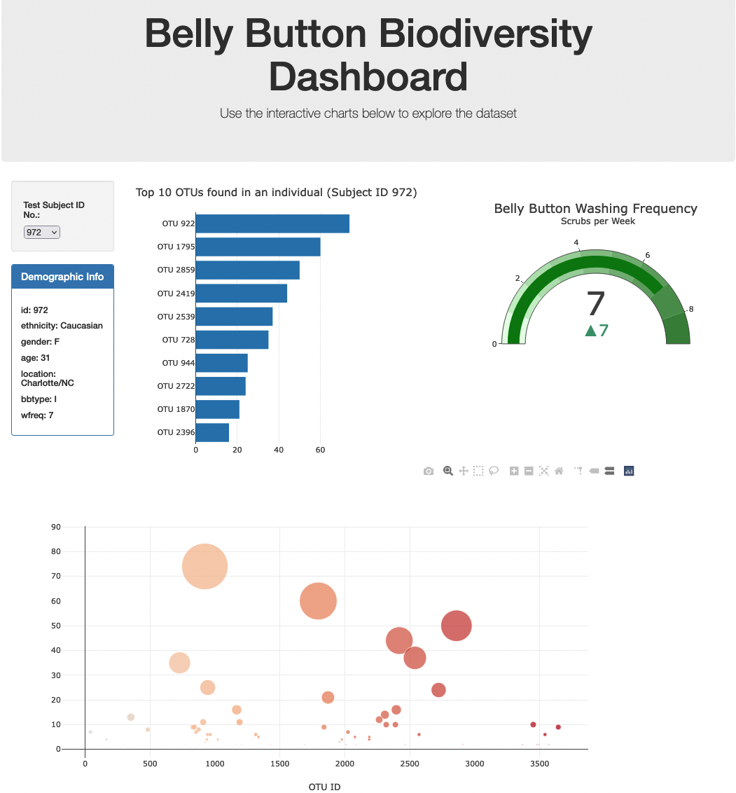

Interactive Web Visualizations – Belly Button Biodiversity

Author: Rosie Gianan, gianr00@gmail.com

Website URL: https://gianr00.github.io/Interactive_Web_Visualizations_Belly_Button_Biodiversity/

Build With: JavaScript with D3.js, Plotly and Event handling with D3.

Goals:

This project builds an interactive dashboard to explore the [Belly Button Biodiversity dataset](http://robdunnlab.com/projects/belly-button-biodiversity/), which catalogs the microbes that colonize human navels. 

The dataset reveals that a small handful of microbial species (also called operational taxonomic units, or OTUs, in the study) were present in more than 70% of people, while the rest were relatively rare.

This analysis visualizes and displays the person’s OTUs through plots using samples.json file from the URL `https://2u-data-curriculum-team.s3.amazonaws.com/dataviz-classroom/v1.1/14-Interactive-Web-Visualizations/02-Homework/samples.json`.

Solutions:

The dashboard allows the user to select a subject ID to be analyzed. The dashboard displays the data visualizations results for the selected subject id using the following charts:

1.    A Horizontal bar chart that displays the top 10 OTUs found in that individual.
2.    A bubble chart that displays each sample of  person’s OTUs.
3.    A gauge chart to plot the weekly washing frequency of the individual.
4.    Displays individual's demographic information.

Image of the dashboard showing charts for a selected subject ID:

