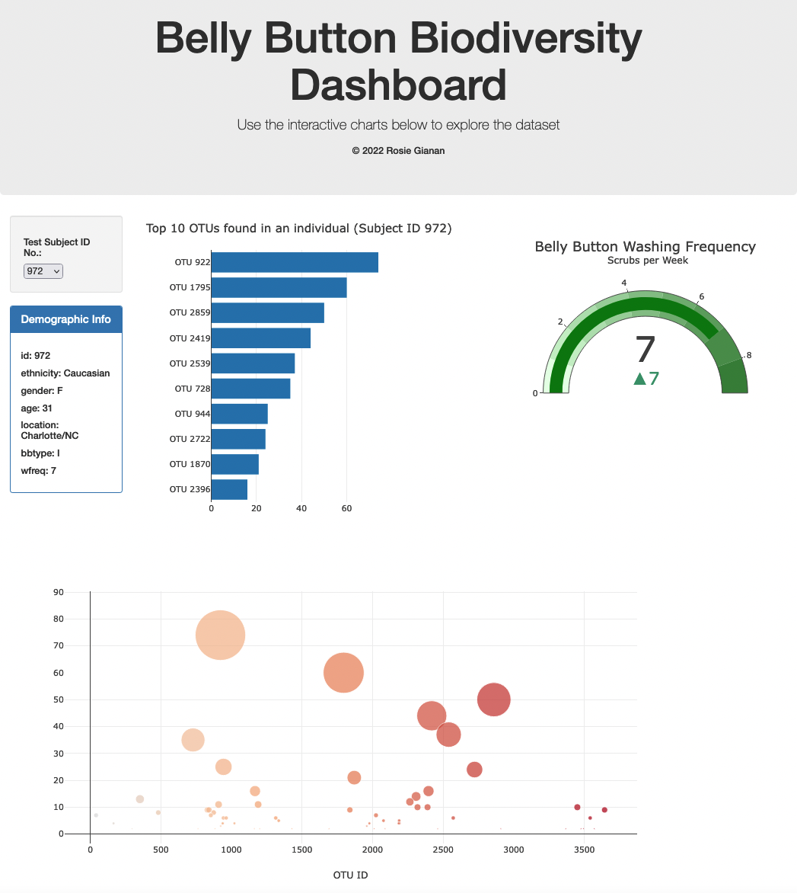

# Interactive Web Visualizations – Belly Button Biodiversity

Author: Rosie Gianan, gianr00@gmail.com

Website URL: https://gianr00.github.io/Interactive_Web_Visualizations_Belly_Button_Biodiversity/

Build with: JavaScript with D3.js, Plotly, Event handling with D3, HTML

## Objective:
Build an interactive dashboard to explore the [Belly Button Biodiversity dataset](http://robdunnlab.com/projects/belly-button-biodiversity/), which catalogs the microbes that colonize human navels. 

The dataset reveals that a small handful of microbial species (also called operational taxonomic units, or OTUs, in the study) were present in more than 70% of people, while the rest were relatively rare.

Visualize and display the person’s OTUs through plots using samples.json file from the URL `https://2u-data-curriculum-team.s3.amazonaws.com/dataviz-classroom/v1.1/14-Interactive-Web-Visualizations/02-Homework/samples.json`.

## Solution:
1.    Create a dashboard that allows the user to select a subject ID of an individual. 
2.    Analyze and visualize the data for the selected subject id and display the results using the following charts:
-    A Horizontal bar chart that displays the top 10 OTUs found in an individual.
-    A bubble chart that displays each sample of  person’s OTUs.
-    A gauge chart to plot the weekly washing frequency of the individual.
-    Displays individual's demographic information.

## Image of the dashboard showing charts for a selected subject ID:

